  

  <samp>GAME DEVELOPMENT &nbsp;·&nbsp; 3D ART &nbsp;·&nbsp; WORLDBUILDING</samp>

게임의 규칙이 손끝의 감각이 되고, 형태와 빛이 하나의 세계가 되는 과정을 공부합니다.
Unity로 플레이 가능한 시스템을 만들고 Blender로 그 세계의 형태를 탐구합니다.
서브컬처의 낯선 발상과 아름다운 연출을 좋아합니다.

### Now exploring

| | Project | Focus |
|:--:|:--|:--|
| ✦ | [game_skill](https://github.com/oscar87657/game_skill) | 2.5D 메트로배니아의 이동·전투·월드 시스템 연구 |
| ◇ | [GRAPHACLYSM](https://github.com/oscar87657/GRAPHACLYSM) | 수식 파편으로 싸우는 Unity 덱 빌딩 로그라이트 |
| ○ | [blender](https://github.com/oscar87657/blender) | 3D 모델링과 시각 실험의 기록 |

### Working with

`Unity` · `C#` · `ShaderLab` · `Blender` · `Python` · `Git`

  Building quiet worlds with sharp edges.

