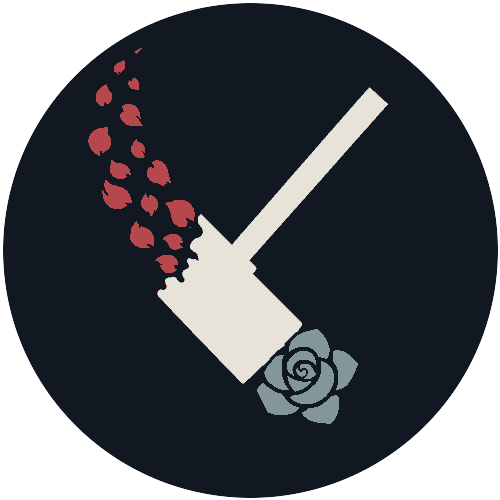

<p align="center">
  
</p>

<p align="center">
  <samp>GAME DEVELOPMENT &nbsp;·&nbsp; 3D ART &nbsp;·&nbsp; WORLDBUILDING</samp>
</p>

<p align="center">
  게임의 규칙, 공간의 형태, 빛의 정서를 엮어<br />
  <b>플레이할 수 있는 세계</b>를 공부하고 만듭니다.
</p>

<p align="center">
  <sub>명확한 규칙 위에, 부드럽고 낯선 감각을 남기는 것.</sub>
</p>


### Ⅰ — THE WORKSHOP

<table>
  <tr>
    <td width="30%" align="center">
      
    </td>
    <td width="70%" valign="middle">
      <h2>환영공방</h2>
      <p><samp>MABOROSHI WORKS · まぼろし工房</samp></p>
      <p><b>보이지 않던 세계를 빚습니다.</b></p>
      <sub>게임의 규칙과 3D 형태, 빛과 움직임으로 아직 형태를 얻지 못한 환영을 플레이 가능한 세계로 만드는 개인 창작 레이블.<br /><br />소실되며 흩날리는 붉은 장미꽃잎은 창작에 바치는 열정, 타격점의 푸른 장미는 불가능해 보이던 꿈이 기술을 통해 피어나는 순간을 뜻합니다.</sub>
    </td>
  </tr>
</table>

<p align="center">
  <i>환영은 없는 것이 아니라, 아직 형태를 얻지 못한 것.</i>
</p>


### Ⅱ — IDENTITY

<table width="100%">
  <thead>
    <tr>
      <th width="33%" align="center">◇&nbsp;SYSTEM</th>
      <th width="34%" align="center">△&nbsp;FORM</th>
      <th width="33%" align="center">✦&nbsp;ATMOSPHERE</th>
    </tr>
  </thead>
  <tbody>
    <tr>
      <td align="center">움직임과 전투의 감각</td>
      <td align="center">3D 모델링과 형태</td>
      <td align="center">서브컬처와 다크 판타지</td>
    </tr>
    <tr>
      <td align="center">규칙으로 빚는 플레이</td>
      <td align="center">재질·빛의 관계 탐구</td>
      <td align="center">아방가르드한 시각 언어</td>
    </tr>
  </tbody>
</table>

<br />

Unity로 시스템을 구현하고 Blender로 세계의 형태를 탐구합니다. 기능을 만드는 데서 멈추지 않고, 왜 그 구조가 필요한지와 플레이어에게 어떤 감각으로 닿는지를 함께 기록합니다.


### Ⅲ — SELECTED WORK

<table>
  <tr>
    <td width="50%" valign="top">
      <a href="https://github.com/oscar87657/game_skill">
        
      </a>
      <h3>01 / game_skill</h3>
      <p>플레이 가능한 2.5D 메트로배니아를 실험장으로 삼아 이동·전투·연결 월드의 구현 방식을 연구합니다.</p>
      <p><code>Unity</code> <code>C#</code> <code>URP</code></p>
    </td>
    <td width="50%" valign="top">
      <a href="https://github.com/oscar87657/GRAPHACLYSM">
        
      </a>
      <h3>02 / GRAPHACLYSM</h3>
      <p>수식 파편 카드를 조립해 그래프를 만들고, 같은 작도로 싸우는 Unity 덱 빌딩 로그라이트입니다.</p>
      <p><code>Unity</code> <code>C#</code> <code>Game Design</code></p>
    </td>
  </tr>
</table>

<p align="center">
  <a href="https://github.com/oscar87657/blender"><b>03 / BLENDER STUDIES</b></a><br />
  <sub>3D 모델링과 시각 실험의 기록</sub>
</p>


### Ⅳ — CURRENT SIGNAL

```text
NOW       Unity 기반 게임 시스템과 플레이 감각 연구
FORM      Blender 모델링 · 형태와 실루엣 탐구
VISUAL    ShaderLab · 빛과 재질의 표현
DRAWN TO  Subculture · Dark Fantasy · Experimental Interface
```

<p align="center">
  <code>Unity</code> · <code>C#</code> · <code>ShaderLab</code> · <code>Blender</code> · <code>Python</code> · <code>Git</code>
</p>


### Ⅴ — YET TO TAKE FORM

앞으로 형태를 부여할 작은 프로젝트들. 아래 이름은 가제이며, 하나씩 완성하며 다음 단계로 이어갈 학습 계획입니다.

- [ ] **01 / 안개 속 공방 — 실시간 3D 디오라마**<br />
  방 하나와 직접 만든 소품 5개로 환영공방의 공간을 구현합니다. Blender 모델링부터 UV·베이킹·텍스처, Unity 조명까지 제작 과정을 연결합니다.<br />
  **완성 기준:** Unity에서 둘러볼 수 있는 장면, 최종 렌더, 와이어프레임과 제작 과정 정리.

- [ ] **02 / 꽃잎으로 흩어지는 망치 — 셰이더와 이펙트 실험**<br />
  로고의 망치를 3D로 만들고, 표면이 붉은 꽃잎으로 흩어졌다가 돌아오는 효과를 구현합니다. 디졸브 마스크·파티클·타이밍을 조합하고 효과 전후의 렌더링 비용을 비교합니다.<br />
  **완성 기준:** 강도와 속도를 조절할 수 있는 효과 하나, 짧은 시연 영상, 구현 원리와 성능 기록.

- [ ] **03 / 한 번의 타격 — 1 대 1 전투 프로토타입**<br />
  작은 전투 공간에 플레이어 하나와 적 하나를 배치합니다. 간단한 캐릭터의 리깅·공격 애니메이션을 만들고, 이동·회피·공격 판정·적 상태 전환·타격 피드백을 연결합니다. 기존 이동·전투 실험에서 필요한 코드를 재사용합니다.<br />
  **완성 기준:** 시작부터 승리·패배·재도전까지 이어지는 전투, 플레이테스트를 반영한 개선 기록.

- [ ] **04 / 남겨진 환영 — 10분 분량의 짧은 게임**<br />
  앞선 작업을 바탕으로 작은 맵 하나와 핵심 기믹 하나, 엔딩 하나를 완성합니다. 탐색과 전투를 엮으며 UI·사운드·설정·체크포인트 저장과 불러오기까지 마무리합니다.<br />
  **완성 기준:** 다른 사람이 처음부터 끝까지 플레이할 수 있는 공개 빌드와 소개 페이지, 피드백을 반영한 수정 버전.

<p align="center">
  <sub>각 작업에는 실행 방법 · 시연 영상 · 배운 점 · 다음에 고칠 점을 남깁니다.</sub>
</p>

<p align="center">
  <a href="https://github.com/oscar87657?tab=repositories">모든 작업의 흔적 보기 →</a>
</p>

<p align="center">
  
</p>
