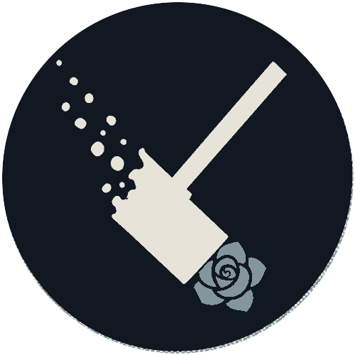

<p align="center">
  
</p>

<p align="center">
  <samp>GAME DEVELOPMENT &nbsp;·&nbsp; 3D ART &nbsp;·&nbsp; WORLDBUILDING</samp>
</p>

<p align="center">
  게임의 규칙, 공간의 형태, 빛의 정서를 엮어<br />
  <b>플레이할 수 있는 세계</b>를 공부하고 만듭니다.
</p>

<p align="center">
  <sub>명확한 규칙 위에, 부드럽고 낯선 감각을 남기는 것.</sub>
</p>


### Ⅰ — THE WORKSHOP

<table>
  <tr>
    <td width="30%" align="center">
      
    </td>
    <td width="70%" valign="middle">
      <h2>환영공방</h2>
      <p><samp>MABOROSHI WORKS · 幻影工房</samp></p>
      <p><b>보이지 않던 세계를 빚습니다.</b></p>
      <sub>게임의 규칙과 3D 형태, 빛과 움직임으로 아직 형태를 얻지 못한 환영을 플레이 가능한 세계로 만드는 개인 창작 레이블.<br /><br />소실되는 망치는 환영이 현실의 형태를 얻는 과정, 타격점의 푸른 장미는 불가능해 보이던 꿈이 기술을 통해 피어나는 순간을 뜻합니다.</sub>
    </td>
  </tr>
</table>

<p align="center">
  <i>환영은 없는 것이 아니라, 아직 형태를 얻지 못한 것.</i>
</p>


### Ⅱ — IDENTITY

<table>
  <tr>
    <td width="33%" align="center">
      <b>◇ SYSTEM</b><br /><br />
      <sub>게임의 움직임과 전투,<br />규칙이 만드는 플레이 감각</sub>
    </td>
    <td width="33%" align="center">
      <b>△ FORM</b><br /><br />
      <sub>3D 모델링을 통해 탐구하는<br />형태·재질·빛의 관계</sub>
    </td>
    <td width="33%" align="center">
      <b>✦ ATMOSPHERE</b><br /><br />
      <sub>서브컬처, 다크 판타지,<br />아방가르드한 시각 언어</sub>
    </td>
  </tr>
</table>

<br />

Unity로 시스템을 구현하고 Blender로 세계의 형태를 탐구합니다. 기능을 만드는 데서 멈추지 않고, 왜 그 구조가 필요한지와 플레이어에게 어떤 감각으로 닿는지를 함께 기록합니다.


### Ⅲ — SELECTED WORK

<table>
  <tr>
    <td width="50%" valign="top">
      <a href="https://github.com/oscar87657/game_skill">
        
      </a>
      <h3>01 / game_skill</h3>
      <p>플레이 가능한 2.5D 메트로배니아를 실험장으로 삼아 이동·전투·연결 월드의 구현 방식을 연구합니다.</p>
      <p><code>Unity</code> <code>C#</code> <code>URP</code></p>
    </td>
    <td width="50%" valign="top">
      <a href="https://github.com/oscar87657/GRAPHACLYSM">
        
      </a>
      <h3>02 / GRAPHACLYSM</h3>
      <p>수식 파편 카드를 조립해 그래프를 만들고, 같은 작도로 싸우는 Unity 덱 빌딩 로그라이트입니다.</p>
      <p><code>Unity</code> <code>C#</code> <code>Game Design</code></p>
    </td>
  </tr>
</table>

<p align="center">
  <a href="https://github.com/oscar87657/blender"><b>03 / BLENDER STUDIES</b></a><br />
  <sub>3D 모델링과 시각 실험의 기록</sub>
</p>


### Ⅳ — CURRENT SIGNAL

```text
NOW       Unity 기반 게임 시스템과 플레이 감각 연구
FORM      Blender 모델링 · 형태와 실루엣 탐구
VISUAL    ShaderLab · 빛과 재질의 표현
DRAWN TO  Subculture · Dark Fantasy · Experimental Interface
```

<p align="center">
  <code>Unity</code> · <code>C#</code> · <code>ShaderLab</code> · <code>Blender</code> · <code>Python</code> · <code>Git</code>
</p>

<p align="center">
  <a href="https://github.com/oscar87657?tab=repositories">모든 작업의 흔적 보기 →</a>
</p>

<p align="center">
  
</p>
